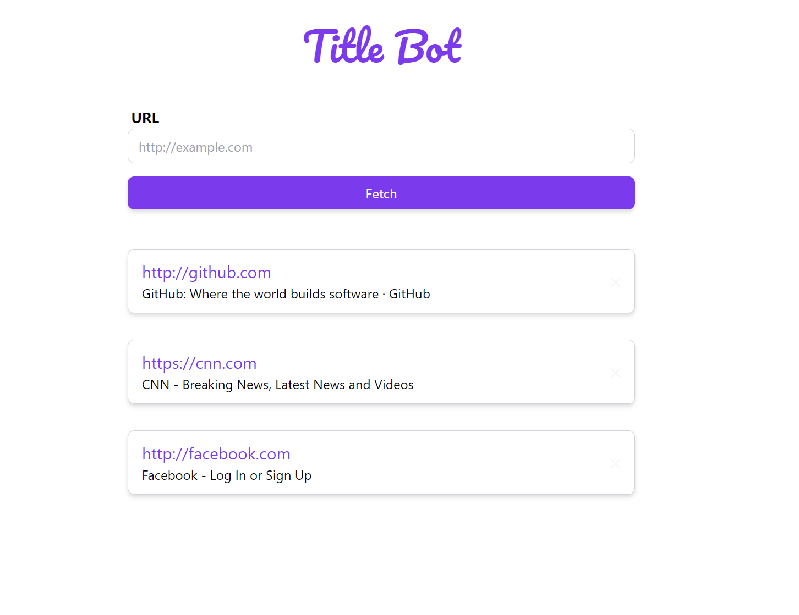

# Title Bot

This app fetches the title of a given website. The stack of this app consists
of a MongoDB database to keep track of visited sites and their titles, a
Nodejs Express app using Typescript that has several endpoints to fetch,
create & delete records of urls and their titles, and finally a Vue with
Tailwind UI to display the app to the user in a pleasant manner.

## Setup

1. Clone the project onto your machine.
2. If you using docker & docker-compose run the command `docker-compose up`

- If not using docker, then tranverse to frontend and backend folder and
  run `npm install` in each directory,

3. Head over to your browser, and go to `localhost:8081`

## Quicklook

